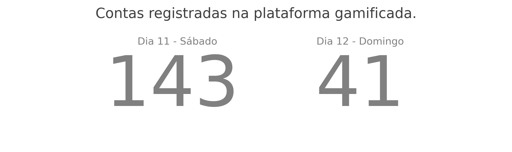
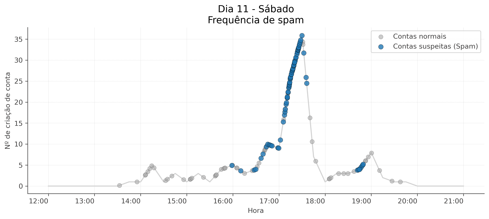
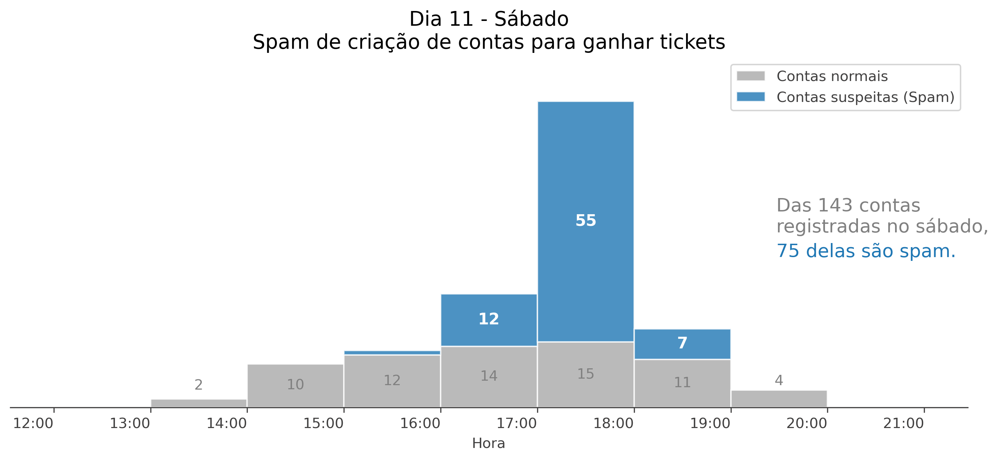
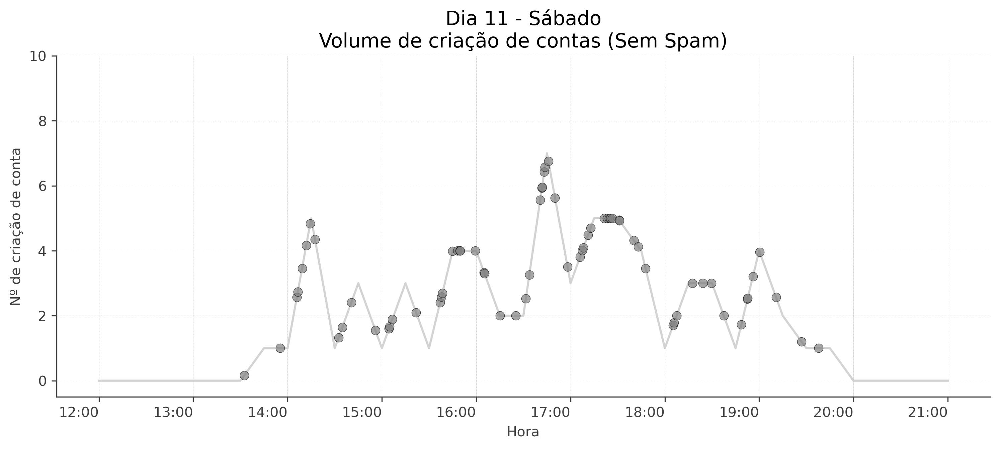
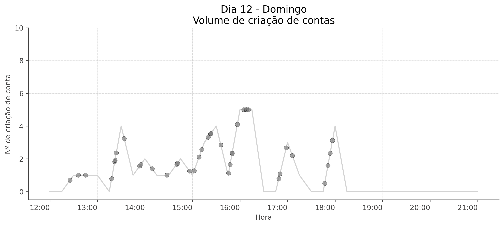
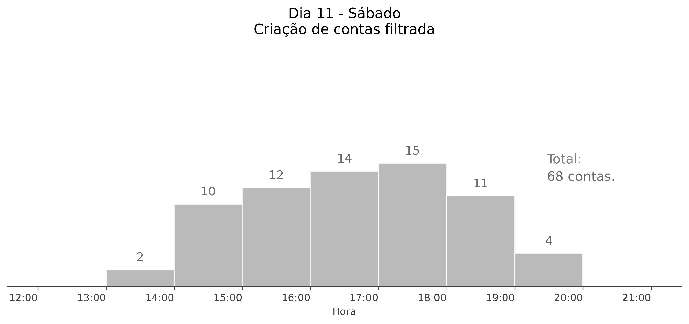
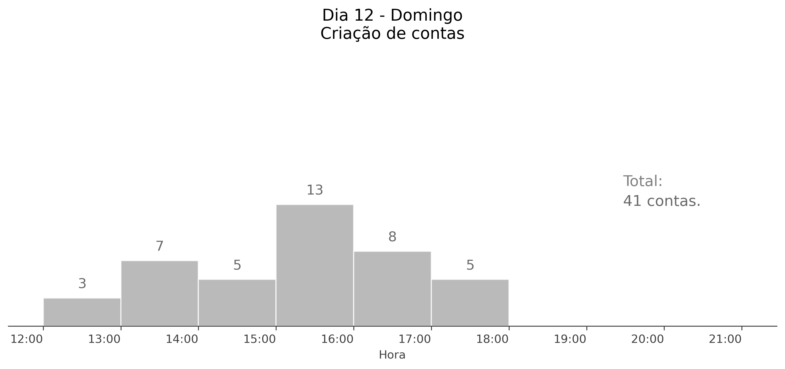

# MageXP & Rethink3D

## Sobre o evento
Nos dias 11 e 12 de julho de 2026, a Rethink3D participou do Maranhão Geek Experience (MAGEXP), em São Luís, um evento para a comunidade geek do Maranhão, reunindo gamers, otakus, fãs de k-pop, creators e artistas. [magexp](https://magexp.com.br/)

A participação no evento tinha como objetivo a divulgação da plataforma web e mobile da Rethink3D para novos usuários. Além disso, buscávamos entender melhor o público jovem ludovicense a partir de um formulário de perguntas, mas quem responderia a um forms maçante e tedioso, nos padrões do Google?

## Sobre a plataforma gamificada
Para solucionar esse problema, criamos nosso próprio forms, personalizável e com a mesma estética geek do evento. Para motivar os visitantes a responder, criamos também um sorteio gamificado de 5 prêmios: quem respondesse e acumulasse mais pontos em quizzes nerds e outras missões teria mais chances de ganhar. Dessa maneira, o forms virou uma das missões dessa dinâmica digital gamificada, e completar as missões resultava em mais pontos, aumentando a probabilidade de ganhar os prêmios nos sorteios.

A fim de espalhar o sorteio para o maior número de pessoas dentro do evento, usamos a lógica de código único: ao passar seu código para um amigo, tanto você quanto ele recebem mais pontos no momento da criação da conta. Assim, as pessoas eram incentivadas a convidar outras pessoas a criarem contas para participar do sorteio. A criação de conta não era difícil: apenas com um número de celular (sem validação), um nome e uma senha, já era possível criar uma conta.

No total, tivemos **184 contas registradas na plataforma gamificada**, um resultado bastante otimista, que no dia do evento nos mostrou que a plataforma estava bombando. Porém, após o evento, fiz a análise no banco de dados e descobri que três participantes recomendaram, respectivamente, 35, 20 e 20 amigos. Mesmo sendo duvidoso, isso é totalmente possível se eles forem pessoas muito populares. Mas, analisando a tendência e os horários das criações das contas, obtive o seguinte resultado:

Em menos de 30 minutos, 35 contas foram criadas usando o mesmo código de amigo de um dos participantes. Como o processo de criação de contas era simples demais, decidimos que essas contas, que usaram o código de amigo desses 3 usuários, devem ser consideradas spam, o que infla as estatísticas do evento com dados falsos.

Felizmente, no domingo, dia 12, não houve nenhuma ocorrência ou suspeita de spam, e poderemos analisar futuramente os dados após a remoção das contas suspeitas.

  
  

  
  

